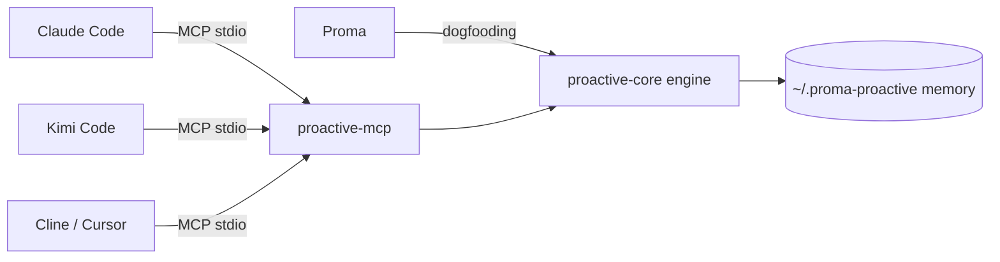

# ProactiveAgent 🧠

> **Teach once, use everywhere.** Let Claude Code / Kimi Code / Cline / Cursor / Proma share the same "proactive memory" — it doesn't just remember what you taught; it **proactively speaks up at the right moment**. One MCP mount, every agent instantly gains proactive abilities.

> **Unlike memory tools that only "remember"**: ProactiveAgent remembers, and also speaks up when it should — five kinds of proactive suggestions: correction, follow-up, automation, todo, skill.

<p align="center">
  <a href="README.md">中文</a> · <b><a href="README.en.md">English</a></b>
</p>

[](LICENSE)
[](https://nodejs.org)
[](https://github.com/ConradLu2740/ProactiveAgent)
[](https://smithery.ai/servers/1797650355/proactive-agent)
[](https://www.npmjs.com/package/@proactive-agent/mcp)
[](https://www.npmjs.com/package/@proactive-agent/mcp)
[](https://www.npmjs.com/package/@proactive-agent/mcp)

---

## 🎬 The 30-second Story

> Everything below is real output from 2026-08-05, not a demo animation: Claude Code writes memory → Kimi Code recalls it (100% hit); behavior corrections / recurring requests → proactive suggestions hit and are accepted.

**👉 Open the interactive story page: [Live demo (English · GitHub Pages)](https://conradlu2740.github.io/ProactiveAgent/story.en.html) · [中文版](https://conradlu2740.github.io/ProactiveAgent/story.html)**
> ⚠️ GitHub `blob` pages are code viewers and do not execute HTML scripts — use the Pages link above for the interactive demo.

| Scenario | Measured Result |
|---|---|
| Cross-tool sharing | Claude Code `memory_capture` writes → Kimi Code `memory_recall` hits (100% relevance, zero config) |
| Proactive suggestion: correction | "Always write unit tests before committing" → `suggest_now` detects correction → `suggest_accept` → feedback loops back |
| Proactive suggestion: automation | "Check project progress at 5pm daily" → `suggest_now` detects automation → accepted → scheduled |
| **Kimi one-command install (2026-08-12)** | `/plugins install .../kimi-plugin.zip` → plain `kimi` sessions get proactive memory automatically (model proactively captures per plugin instructions → recall hits in new sessions, no `--agent` needed) |
| **Kimi three-way proactivity (2026-08-12)** | Full hooks chain after 0.35 restored: session-start injection (today-push) → mid-session `<notification>` relay (kimi-user-prompt) → session-end memory settle (kimi-session-end, pending by default) |
| **UMP interop (2026-08-12)** | `ump-export` → official `@universalmemoryprotocol/core` loads 5/5 + recall (scope.owner) hits — memory is never locked to any tool |

---

## Why It's Worth Using

### 🎯 Memory is a "user-level asset", not a "tool-level asset"

Preferences you teach Claude Code **automatically work** in Kimi Code, Cline, etc. — because memory lives in `~/.proma-proactive/`, and every agent reads/writes the same memory through the same MCP server.

> Stop re-teaching every tool. Teach once — every agent remembers.

### 💡 Proactive suggestions: silent when it should be silent

Not a noisy pusher — it speaks only when there's a signal, with **restraint that has parameters**:
- You corrected the agent → suggest persisting the rule into long-term memory (prevent recurrence)
- You keep repeating the same task → suggest automation / SOP
- Small talk, rejections, quiet hours → **silent** (that's the skill)
- **Restraint is tunable**: 6 notifications/day cap, 15-min cooldown, DND hours (suggestions are kept, not dropped), persona-level "don't bother me" → auto down-rate

### 🔔 It speaks even with the terminal closed: daemon + desktop notifications

`proactive-mcp daemon --install` runs persistently (launchd/systemd): even with no agent open, it **reviews pending suggestions and speaks up via desktop notification** (macOS Notification Center / Windows tray / Linux notify-send); clicking the notification opens the proactive center, one-click accept lands the task.

### 🔄 Memory is not locked in: UMP interop

`proactive-mcp ump-export` exports memory as a standard Universal Memory Protocol file — **loadable and recallable by the official UMP SDK**. Your memory is your asset; take it anywhere UMP goes.

### 🛡️ Poisoning-resistant design, memory safety as a baseline

- Auto-extracted memory defaults to **pending (awaiting confirmation)** — blocks malicious/incorrect injections before recall
- **Same-source principle** for LLM config: apiKey decides the trust source, never mixes across sources (anti key-hijack)
- Every memory/correction can be **viewed, confirmed, rejected, deleted**

### 🔌 Plug-and-play, one MCP for all

Standard MCP protocol (stdio), **zero code change** to mount on any MCP-capable agent. Already validated on **three different hosts: Claude Code, Kimi Code, Proma** (8/12: Kimi additionally gets a one-command plugin); also on Smithery: `npx -y smithery mcp add 1797650355/proactive-agent`.

---

## Quick Start (< 1 min, no clone / no bun required)

> ✅ Published to npm! One command.

**Option A (recommended): install via npm**
```bash
# One-command version (no install, pulls directly from npm)
npx -y @proactive-agent/mcp init

# Or install first, then use the local bin
npm install @proactive-agent/mcp
npx proactive-mcp init
```

> Only requires node >= 18. `init` generates a `.mcp.json` pointing to your local install, zero extra deps.

**Or mount manually (no install, pull via npx):**
```bash
# Claude Code
claude mcp add proactive-agent -- npx -y @proactive-agent/mcp
```

**Option B (Kimi Code users, one command):**
```text
/plugins install https://github.com/ConradLu2740/ProactiveAgent/releases/latest/download/kimi-plugin.zip
/reload
```
Plain `kimi` sessions get proactive memory automatically (no `--agent` needed); optionally `kimi --agent proactive` for the aggressive mode. See the [Kimi Code usage guide](kimi-plugin/README.md).
```

**Option C: clone the repo (development / customization)**
```bash
git clone https://github.com/ConradLu2740/ProactiveAgent.git && cd ProactiveAgent
npm install
npm run start:mcp
```

> ⚠️ `npm run start:mcp` keeps running in the foreground — this is the expected blocking behavior of a stdio MCP server (waiting for agent connections), not a hang. Keep it running and connect from your agent.

**Option D: start a local proactive center panel**
```bash
# Works whether installed or not
npx -y @proactive-agent/mcp --today
# Open http://127.0.0.1:8737/today — suggestions, scenes, persona, stats at a glance
```

(When developing from a clone, `npm run start:today` also works)


*Today panel: pending suggestions + hot scenes + memory stats + user persona (15s auto refresh)*

**Verify right after mounting (~1 minute):**
1. Open Claude Code (or your agent; Kimi users: `init --kimi`) and start a session
2. Type: `always write unit tests before committing from now on`
   → you should get a "persist this rule to long-term memory?" suggestion (suggest_now)
3. Then type: `I prefer TypeScript and Bun`, then ask: `what are my preferences?`
   → recalling the memory above = cross-tool memory works

> Not working? Run `proactive-mcp doctor` for one-click diagnostics.

### LLM requirements

| Feature | Needs LLM key? | Notes |
|---|---|---|
| `memory_capture` / `memory_recall` / `persona_*` / `scene_summary` / `suggest_*` / `daily_review` / `onboarding_guide` | No | Deterministic local rules, works out of the box |
| `memory_extract` | Optional | Set `MEMORY_LLM_*` for LLM extraction (DeepSeek-compatible by default); without it, auto-degrades to rule mode, zero outbound traffic |
| `memory_recall` synonym expansion | Optional enhancement | With LLM, auto-adds synonym recall; without it, rule-based synonyms are used |

Optional config example (only needed for `memory_extract`):

```bash
# ~/.proma-proactive/.env (or project .env, prefer chmod 600)
MEMORY_LLM_API_KEY=sk-xxx
MEMORY_LLM_BASE_URL=https://api.deepseek.com/v1
MEMORY_LLM_MODEL=deepseek-chat
```

### Host configuration differences

| Host | Generated by `init` | Proactive push mechanism | Extra manual steps |
|---|---|---|---|
| Claude Code | `.mcp.json` + `.claude/settings.json` hooks | 3-layer hooks (SessionStart / UserPromptSubmit / Stop) | None (interactive TUI; `claude -p` needs `--allowedTools`) |
| Kimi Code | `.mcp.json` + `~/.kimi-code/mcp.json` + `agents/proactive.md` (via `init --kimi`) | Prompt-driven (`kimi --agent proactive`) | Needs kimi login/API key; **pick either this or kimi-plugin, not both** |
| Cursor | `.mcp.json` | Official mapping of Claude hooks | Confirm `.mcp.json` is detected; enable third-party hooks compat* |
| Cline | `.mcp.json` | Manual | Wire `event-capture.js` manually (optional)* |
| Codex | `.mcp.json` | Manual | Wire `event-capture.js` manually (optional)* |

> \* Only Claude Code / Kimi Code / Proma are verified in this repo; Cursor / Cline / Codex entries follow official docs.

> ⚠️ **Claude Code non-interactive note**: hooks only fire in interactive TUI sessions; `claude -p` script/CI mode does **not** trigger hooks. In scripts, use `claude -p --allowedTools "mcp__proactive-agent__*"` to explicitly authorize MCP tools and let the model call `suggest_now` / `memory_capture` directly (note: `--permission-mode acceptEdits` does NOT grant MCP tool permissions — explicit `--allowedTools` is required).

---

## Capabilities

### Tools (20, available on any host)

| Category | Tool | What it does |
|---|---|---|
| 🧠 Memory write | `memory_capture` | Explicitly remember a preference/fact/correction/SOP (immediate effect; scope: project/global) |
| 🧠 Memory extract | `memory_extract` | Extract memory from a conversation via the engine (pending by default, anti-poisoning) |
| 🔍 Memory recall | `memory_recall` | Keyword/hybrid retrieval, injected before task start (auto: project + global merge) |
| ✅ Memory loop | `memory_pending` / `memory_confirm` / `memory_reject` / `correction_confirm` / `correction_reject` | Confirm/reject pending memories + behavior corrections |
| 👤 Persona | `persona_get` / `persona_save` | Read merged persona (global base + project override) / manually save persona |
| 🔥 Scenes | `scene_summary` | Recent hot scenes ("what you've been busy with") |
| 📊 Stats | `memory_stats` | Memory system statistics |
| 💡 Suggestions | `suggest_now` / `suggest_list` / `suggest_accept` / `suggest_ignore` | Proactive suggestion evaluation + feedback loop (frequency learning) |
| 🃏 ActionCards | `card_list` / `card_get` | Unified cross-source ActionCard protocol view (current source: suggestion; future: agent/automation/bridge) |
| 📋 Templates | `daily_review` / `onboarding_guide` | Daily review / getting-started guide |

### Resources & Prompts

- `memory://today` — today's suggestions + hot scenes
- `memory://stats`、`memory://persona`
- Prompts: `daily_review` (daily review), `onboarding` (cold-start guide)

### Additional capabilities

- **/today Web panel**: local proactive center (15s auto refresh), any host can open it in a browser; `POST /api/evaluate` lets a host push recent messages to trigger mid-session evaluation
- **Claude Code hooks (three layers)**:
  - `SessionStart` (today-push): push pending suggestions + hot scenes at session start
  - `UserPromptSubmit` (user-prompt): **mid-session real-time evaluation** — say "always use pnpm from now on", get a correction suggestion immediately; weak signals stay silent
  - `Stop` (session-end): settle memory + evaluate suggestions at session end
- **Kimi Code hooks (proactive relay)**: `UserPromptSubmit` outputs `<notification>` XML aligned with Kimi's task notification convention — the Kimi model sees the notification and proactively relays the suggestion ("You said X last time, want to remember it?"), reusing the Kimi externalHooks channel.
  > ⚠️ **Prerequisite**: Kimi Code must be logged in or have an API key configured (`kimi` first run `/login`, or set `[providers.<name>]` + `api_key` in config.toml). Without it, `kimi -p` fails with `No model configured`. Diagnose with: `kimi doctor` / `kimi provider list`.
  **Kimi hooks config is TOML** (not JSON), written in `~/.kimi-code/config.toml`:
  ```toml
  [[hooks]]
  event = "UserPromptSubmit"
  command = "node <mcp install path>/dist/hooks/kimi-user-prompt.js"
  timeout = 10
  ```
  > Only `event` / `matcher` / `command` / `timeout` are allowed; `UserPromptSubmit` fires when the user sends a message, hook stdout is appended to the context, and the model relays the suggestion after seeing the `<notification>`.

---

## Use Cases

### Scenario 1: Cross-tool shared long-term memory
```
Today: In Claude Code say "I prefer TypeScript"
Tomorrow: Open Kimi Code to write code — it auto-recalls your preference and follows it
```

### Scenario 2: From "correction" to "never again"
```
You say: "always write unit tests before committing from now on"
→ suggest_now detects it as a correction suggestion
→ you click "accept": the rule is written into memory + flows back into the persona
→ every agent obeys from then on
```

### Scenario 3: Mid-session proactive suggestion (0.5.0)
```
In Claude Code you type: "run tests before committing from now on"
→ UserPromptSubmit hook evaluates in real time (evaluateNow, session_mid)
→ suggestion injected into the current session: "Remember this correction? Accept: suggest_accept"
→ on accept, the rule is written into memory, obeyed by every host next time
```

### Scenario 4: Time-aware scheduled task suggestion (0.5.0)
```
You say: "check release status at 5pm every day"
→ time parser recognizes the period → cron: 0 17 * * *
→ suggestion prefills a real cron, accept to create the scheduled task directly
```

---

## Architecture



- **`@proactive-agent/core`**: headless engine (memory + suggestions), zero runtime deps, consumable by any host
- **`@proactive-agent/mcp`**: MCP Server wrapper (tools/resources/prompts + panel + hooks)

### Memory layering model

```
L1 Atom    structured memory entries (LLM-extracted + dedup + priority)
L2 Scene   scene blocks (recent topic aggregation, proactivity timing signal)
L3 Persona user persona markdown (stable preferences, source-traced)
Correction behavior-correction candidates (need confirmation to take effect)
```

---

## Security & Privacy

| Design | Description |
|---|---|
| Pending by default | Auto-extracted memory needs confirmation before recall — blocks injection chains |
| LLM same-source | apiKey decides the primary trust source; baseUrl/model only from the same source; baseUrl https-only |
| Local-first data | Memory lives on your machine at `~/.proma-proactive/`, no cloud sync |
| User control | Every memory/correction can be confirmed, rejected, deleted, cleared |
| Quiet hours | DND (default 22:30-08:00) produces no new suggestions |
| Restraint principle | At most 1 suggestion per evaluation, same-session budget, "silent when it should be" |

---

## FAQ

**Q: Which agents are supported?**
A: Any MCP-capable agent: Claude Code, Kimi Code, Cline, Cursor, Windsurf, VS Code, etc. Proma is natively supported (dogfooding).

**Q: Where is memory stored?**
A: Default `~/.proma-proactive/`, overridable with `PROACTIVE_DATA_DIR`. Pure local files (JSONL/markdown), easy to back up/migrate.

**Q: Do I need an API key?**
A: No — core features (`memory_capture` / `memory_recall` / `suggest_*`, etc.) work fully locally out of the box; only `memory_extract`'s LLM extraction is optional. See the LLM requirements table in Quick Start.

**Q: How is this different from other memory solutions?**
A: Most are "single-tool passive memory". ProactiveAgent is **cross-tool shared + proactive suggestions** — teach once use everywhere, and only speak proactively at the right moment.

**Q: Does it send my conversations externally?**
A: Only `memory_extract` in LLM mode sends the current conversation snippet to the LLM you configured (default DeepSeek-compatible). Rule mode is zero outbound. Explicit capture/recall is purely local.

**Q: Does performance degrade with large memory?**
A: Since 0.5.4, `memory_recall` uses an <b>inverted index</b> (term → atoms, cached + auto-invalidation + fail-open) that only scans candidate atoms containing query terms — imperceptible for personal/small projects, and stays low-latency even at 10k+ memories. Also watch memory size with `proactive-mcp stats` and use `proactive-mcp archive` for TTL archiving.

---

## Roadmap

- [x] Core engine (memory + suggestions + scenes + persona)
- [x] MCP Server + panel + hooks
- [x] Proma / Claude Code / Kimi Code real validation
- [x] npm release (@proactive-agent/core + @proactive-agent/mcp)
- [x] Per-project memory (0.3.0: project isolation + explicit global sharing + migration + escape hatch)
- [x] Proactive push loop (0.5.0: evaluateNow unified entry + mid-session UserPromptSubmit hooks + Today push endpoint)
- [x] Kimi proactive relay (0.5.0: `<notification>` XML convention, model proactively speaks)
- [x] Action Executor (0.5.2: accept = execute — built-in local task queue default executor, `suggest_accept` really creates scheduled tasks/todos; host-injected real executor auto-overrides)
- [x] SessionStart memory injection (0.5.2: today-push auto-injects persona summary + high-priority memory)
- [x] Suggestion ROI metrics (0.5.0: funnel + type accept rate + auto budget reduction)
- [x] Time/period parsing (0.5.0: zh/en time expressions → cron/dueAt prefill)
- [x] English signals (0.5.0: correction/automation/followup/todo in English)
- [ ] Kimi turn.steer idle self-start (requires internal Kimi agent API, waiting on upstream)
- [x] Metrics panel: accept rate / disturb rate (0.5.0: `suggestionRoiStats` funnel + type accept rate + auto budget reduction, shown in Today ROI section)
- [x] Local embeddings (0.1.x: local node-llama-cpp + embeddinggemma / api dual mode, default off fail-open)
- [x] Bilingual README (0.5.3: README.en.md + language switch)
- [x] Memory indexing (0.5.4: inverted index + cache invalidation + fail-open, supports 10k+ entries)
- [x] Auto-archive / TTL memory management (0.5.4: per-type TTL + env override + archive CLI)

## Contributing

PRs / Issues welcome! Dev environment: Node 22 + TypeScript + Vitest + esbuild. `npm install && npm test && npm run build`

## License

[MIT](LICENSE)

