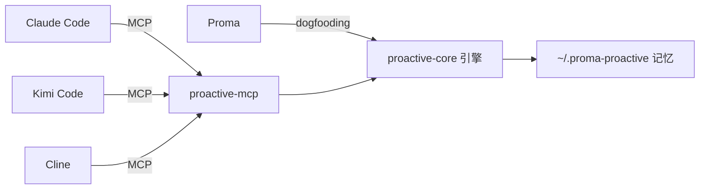

# ProactiveAgent

给任何 agent 项目（Claude Code / Kimi Code / Cline / Cursor / Proma）即插即用的**主动能力外挂**：主动记忆 + 主动建议，通过标准 MCP 协议接入。



## 包

| 包 | 说明 |
|---|---|
| `@proactive-agent/core` | headless 引擎：主动记忆（capture/recall/persona/scene）+ 主动建议（rules/engine/feedback/analyst）。零依赖 bundle |
| `@proactive-agent/mcp` | MCP Server（stdio）：17 工具 / 3 resources / 2 prompts + /today Web 面板 + Claude Code hooks |

## 快速开始

```bash
# 一键生成挂载配置（Claude Code / Kimi Code / Cline / Cursor 通用）
npx -y @proactive-agent/mcp init

# 手动挂载（Claude Code）
claude mcp add proactive-agent -- npx -y @proactive-agent/mcp

# /today 主动中心面板
npx -y @proactive-agent/mcp --today
# → http://127.0.0.1:8737/today
```

## 能力

- **主动记忆**：`memory_capture`（显式记住）/ `memory_recall`（检索）/ `memory_extract`（会话提取，默认待确认防投毒）/ L2 场景聚类 / L3 用户画像（可溯源）
- **主动建议**：`suggest_now`（该沉默时沉默）/ 频率学习反馈 / 免打扰时段
- **数据**：默认 `~/.proma-proactive/`（用户级一份共享，跨工具复用）

详见各包 README。

## 开发

```bash
bun install
bun run typecheck
bun test
bun run build   # 生成 dist-publish/ 发布产物
```

## License

MIT
