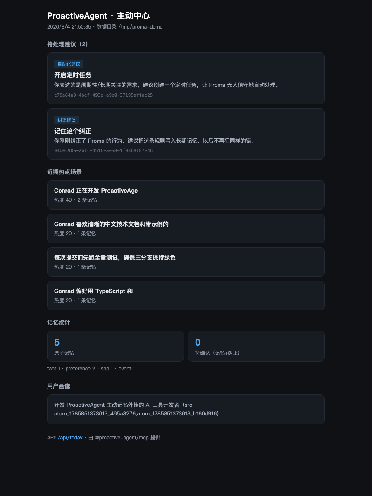
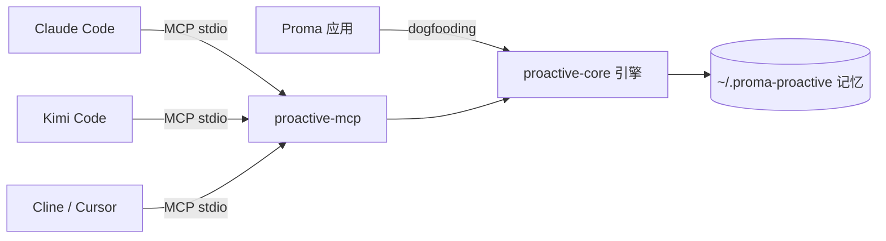

# ProactiveAgent 🧠

> **教一次，处处用。** 让 Claude Code / Kimi Code / Cline / Cursor / Proma 共享同一份「主动记忆」——它不仅记住你教过的一切，更会在**合适的时机主动开口提醒你**。一个 MCP 挂载，所有 agent 立即拥有主动能力。

> **和其他「只会记」的记忆工具不同**：ProactiveAgent 会记，也会在想该提醒你的时刻主动开口——纠正、跟进、自动化、待办、技能，五类主动建议。

<p align="center">
  <b><a href="README.md">中文</a></b> · <a href="README.en.md">English</a>
</p>

[](LICENSE)
[](https://nodejs.org)
[](https://github.com/ConradLu2740/ProactiveAgent)
[](https://smithery.ai/servers/1797650355/proactive-agent)
[](https://www.npmjs.com/package/@proactive-agent/mcp)
[](https://www.npmjs.com/package/@proactive-agent/mcp)
[](https://www.npmjs.com/package/@proactive-agent/mcp)

---

## 🎬 验证故事（30 秒看懂它做了什么）

> 所有内容均为 2026-08-05 真实运行输出，不是演示动画：Claude Code 写入记忆 → Kimi Code 直接召回（100% 命中）；行为纠正 / 周期需求 → 主动建议命中并接受。

**👉 打开交互式演示页：[在线演示（GitHub Pages）](https://conradlu2740.github.io/ProactiveAgent/story.html)**（浏览器直接打开即可）
> ⚠️ GitHub 的 `blob` 页面只是代码查看器、不会执行 HTML 脚本，请使用上方 Pages 链接查看交互演示。

| 场景 | 实测结果 |
|---|---|
| 跨工具共享 | Claude Code `memory_capture` 写入 → Kimi Code `memory_recall` 检索命中（相关度 100%，零配置） |
| 主动建议：纠正 | 「以后提交前先写单元测试」→ `suggest_now` 识别 correction 建议 → `suggest_accept` 接受 → 反馈回流 |
| 主动建议：自动化 | 「每天下午 5 点检查项目进展」→ `suggest_now` 识别 automation 建议 → 接受进入调度 |
| **Kimi 一条命令接入（8/12 实测）** | `/plugins install .../kimi-plugin.zip` → 普通 `kimi` 会话自动主动记忆（模型按插件指令主动 capture → 新会话 recall 命中，无需 `--agent`） |
| **Kimi 三路主动（8/12 实测）** | hooks 恢复后全链路：会话开始注入建议/画像（today-push）→ 过程强信号 `<notification>` 转述（kimi-user-prompt）→ 收尾自动沉淀记忆（kimi-session-end，默认待确认） |
| **UMP 互操作（8/12 实测）** | `ump-export` 导出 → 官方 `@universalmemoryprotocol/core` 加载 5/5 + recall（scope.owner）全命中——记忆不被任何工具锁死 |

---

## 为什么值得用

### 🎯 记忆是「用户级资产」，不是「工具级资产」

你在 Claude Code 里教会它的偏好，Kimi Code、Cline 里**自动生效**——因为记忆存在 `~/.proma-proactive/`，所有 agent 通过同一个 MCP server 读写同一份记忆。

> 告别「每个工具都要重新教一遍」：教一次 TypeScript 偏好，所有 agent 都记得。

### 💡 主动开口：该沉默时沉默

不是话痨推送，而是**有信号才开口、有参数地克制**：
- 你纠正了 agent → 建议把规则写进长期记忆（防重犯）
- 你重复做同一件事 → 建议自动化 / 沉淀为流程
- 闲聊、拒绝、打扰时段 → **安静**（这就是能力）
- **克制是有参数的**：每日通知上限 6 条、冷却 15 分钟、DND 时段不打扰（建议保留不吞）、画像里说过「不想被打扰」自动降频——防疲劳，也防「记仇」

### 🔔 关掉终端也会开口：守护进程 + 桌面通知

`proactive-mcp daemon --install` 一键常驻（launchd/systemd 自启）：即使你没有打开任何 agent，它也会**巡检待处理建议并通过桌面通知主动开口**（macOS 通知中心 / Windows 托盘 / Linux notify-send）；点击通知直达主动中心面板，一键接受即落地任务。

### 🔄 记忆不锁死：UMP 互操作

`proactive-mcp ump-export` 导出为标准 Universal Memory Protocol 文件，**官方 UMP SDK 可加载、可 recall**——记忆是你的资产，想迁移到任何 UMP 生态随时可以带走。

### 🛡️ 防投毒设计，记忆安全有底线

- 自动提取的记忆默认 **pending（待确认）**，你确认才进入召回——阻断恶意/错误内容注入
- LLM 配置**同源原则**：apiKey 决定信任源，绝不跨源混搭，防 key 劫持
- 一条记忆/一条纠正，你都能**查看、确认、拒绝、删除**

### 🔌 即插即用，一个 MCP 挂所有

标准 MCP 协议（stdio），**零代码改动**挂载到任何支持 MCP 的 agent。已在 **Claude Code、Kimi Code、Proma 三个完全不同的宿主**真实验证（8/12：Kimi 另提供一条命令插件安装）；Smithery 已上架：`npx -y smithery mcp add 1797650355/proactive-agent`。

---

## 快速开始（< 1 分钟，无需 clone ）

> ✅ 已发布到 npm！一条命令搞定。

**方式 A（推荐）：npm 直接安装**
```bash
# 一条命令版（免安装，直接从 npm 拉取，适合快速体验）
npx -y @proactive-agent/mcp init

# 或安装后使用（本地 bin）
npm install @proactive-agent/mcp
npx proactive-mcp init
```

> 只需 node >= 18。`init` 会生成指向你本地安装的 `.mcp.json`，零额外依赖。

**或者手动挂载（不装包，直接用 GitHub Release bundle）**：
```bash
# Claude Code
claude mcp add proactive-agent -- node <repo>/dist-publish/mcp/dist/index.js
```

**方式 B（Kimi Code 用户，一条命令）**：
```text
/plugins install https://github.com/ConradLu2740/ProactiveAgent/releases/latest/download/kimi-plugin.zip
/reload
```
装完普通 `kimi` 会话即自动获得主动记忆（无需 `--agent`）；另可 `kimi --agent proactive` 启用激进模式。详见 [Kimi Code 使用指南](kimi-plugin/README.md)。
```

**方式 C：clone 仓库（开发 / 自定义）**
```bash
git clone https://github.com/ConradLu2740/ProactiveAgent.git && cd ProactiveAgent
npm install
npm run start:mcp
```

> ⚠️ `npm run start:mcp` 启动后终端会保持运行——这是 MCP server 的正常阻塞状态（等待 agent 连接），不是卡死；请保持运行，并打开你的 agent 连接它。

**方式 D：起一个本地主动中心面板**
```bash
# 免安装 / 已安装均可
npx -y @proactive-agent/mcp --today
# 打开 http://127.0.0.1:8737/today —— 建议、场景、画像、统计一目了然
```

（clone 仓库开发时也可用 `npm run start:today`）



*主动中心面板：待处理建议 + 热点场景 + 记忆统计 + 用户画像（15s 自动刷新）*

**挂载后立刻试**：
```
agent: 以后提交代码前必须先写单元测试再提交
→ agent 建议把这条规则写入长期记忆（memory_extract / suggest_now）
agent: 我偏好用 TypeScript 和 Bun
→ agent 调用 memory_capture 记住（下次任何工具都记得）
```

---

## 能力总览

### Tools（20 个，任何宿主可用）

| 类别 | 工具 | 干什么 |
|---|---|---|
| 🧠 记忆写入 | `memory_capture` | 显式记住一条（偏好/事实/纠正/流程，立即生效；支持 scope: project/global） |
| 🧠 记忆提取 | `memory_extract` | 把对话交给引擎自动提取（默认待确认，防投毒） |
| 🔍 记忆检索 | `memory_recall` | 关键词/混合检索，任务开始前注入上下文（默认 auto：项目+全局合并） |
| ✅ 记忆闭环 | `memory_pending` / `memory_confirm` / `memory_reject` / `correction_confirm` / `correction_reject` | 待确认记忆 + 行为纠正的确认/拒绝 |
| 👤 画像 | `persona_get` / `persona_save` | 读取合并画像（global base + 项目覆盖）/ 手动保存画像 |
| 🔥 场景 | `scene_summary` | 近期热点场景（"你最近在忙什么"） |
| 📊 统计 | `memory_stats` | 记忆系统统计（含记忆动态：今日变更 / 距上次更新天数 / 3 天复查邀请） |
| 💡 建议 | `suggest_now` / `list` / `accept` / `ignore` | 主动建议评估 + 反馈闭环（频率学习） |
| 🃏 统一卡片 | `card_list` / `card_get` | 跨来源 ActionCard 统一协议视图（当前来源 suggestion，未来 agent/automation/bridge 投递） |
| 📋 模板 | `daily_review` / `onboarding_guide` | 每日复盘 / 使用说明 |

### Resources & Prompts

- `memory://today` — 今日建议 + 热点场景
- `memory://stats`、`memory://persona`
- Prompts：`daily_review`（每日复盘）、`onboarding`（冷启动引导）

### 附加能力

- **记忆维护（0.8.0，对齐 Proma v0.17.0 记忆治理）**：`memory_stats` 展示「今日 X 条动态 · 距上次更新 N 天」；记忆超过 3 天未更新时返回复查邀请（清理过时记忆、确认待确认项、必要时重整画像）；`persona_get` 在画像超载（>45 行 / >6 章节）时提示精简重整；`onboarding_guide` 提供「先建画像 → 再补证据」两阶段引导。
- **/today Web 面板**：本地主动中心（15s 自动刷新），任何宿主都能开浏览器看；`POST /api/evaluate` 支持宿主把最近消息推过来触发会话中评估；建议卡片支持「接受 / 忽略」一键反馈（ActionCard 闭环，接受即落地本地任务）
- **守护进程（0.5.0 主动出口）**：`proactive-mcp daemon` 常驻后台，**巡检待处理建议**并通过**桌面通知**主动开口（macOS 通知中心 / Windows 托盘气泡 / Linux notify-send）；点击通知打开主动中心面板；`--install` 一键配置登录自启（launchd / systemd）；`--status` / `--stop` 管理；`doctor` 包含 daemon 健康检查与**今日疲劳状态**（已通知/上限）。巡检间隔 `PROACTIVE_DAEMON_INTERVAL_MIN`（默认 60 分钟），每次最多通知 1 条、同条不重复打扰、DND 时段不打扰且不吞建议（克制信条）。
- **通知疲劳控制（0.8.0）**：**每日通知上限**（默认 6 条/天，`PROACTIVE_DAEMON_DAILY_LIMIT` 覆盖，跨天自动重置）+ **冷却窗口**（默认 15 分钟，`PROACTIVE_DAEMON_COOLDOWN_MIN` 覆盖）+ **画像驱动打扰系数**——画像含「不要打扰/静默」等规则时上限减半、冷却翻倍（尊重用户「不想被打扰」的表达）；达上限/冷却时建议**保留不吞**，次日继续
- **跨工具感知网（0.6.0）**：统一事件协议——各工具 hooks 把会话/消息/commit 事件归一化写入 `~/.proma-proactive/events/`（仅当前用户可读写），daemon 巡检时读取最近事件构造 messages 做**真定时评估**（完成 0.5 P0-1 遗留）；Claude Code / Kimi Code hooks 已内联写事件，Cursor 官方支持加载 Claude Code hooks 自动接入，Codex/Cline 可用 `dist/hooks/event-capture.js` 通用入口接入；`init` 打印跨工具接入指引；第三方接入指南见 `docs/developers/adapter-guide.md`
- **UMP 互操作（0.7.0 L0）**：`proactive-mcp ump-export` 导出记忆为 Universal Memory Protocol 文件（`.ump/memory.ump.json`），`ump-import` 从 UMP 文件导入（默认待确认防投毒）——任何 UMP 客户端可读写 ProactiveAgent 记忆；兼容评估见 .context 文档，L2 MCP store 桥接待生态成熟
- **Claude Code hooks（三层）**：
  - `SessionStart`（today-push）：会话开始推送待处理建议 + 热点场景
  - `UserPromptSubmit`（user-prompt）：**会话中实时评估**——你说"以后都用 pnpm"，立即收到纠正建议；弱信号自动沉默
  - `Stop`（session-end）：会话结束沉淀记忆 + 评估建议
  > ⚠️ **非交互模式限制**：hooks 仅在 Claude Code **交互式 TUI 会话**中触发；`claude -p` 脚本/CI 模式不触发 hooks。脚本场景请用 `claude -p --allowedTools "mcp__proactive-agent__*"` 显式授权 MCP 工具后，让模型直接调用 `suggest_now` / `memory_capture`（注意：`--permission-mode acceptEdits` 不会授予 MCP 工具权限，必须显式 `--allowedTools`）。
- **Kimi Code hooks（主动转述）**：`UserPromptSubmit` 输出对齐 Kimi task 通知范式的 `<notification>` XML——Kimi 模型看到通知后主动向用户转述建议（"上次你说 X，要记住吗？"），复用 Kimi externalHooks 通道。
  > ⚠️ **前置条件**：Kimi Code 需要先完成登录或配置 API key（`kimi` 首次运行 `/login`，或按 [config.toml](https://moonshotai.github.io/kimi-code/) 配置 `[providers.<name>]` + `api_key`）。未配置时 `kimi -p` 会报 `No model configured`。诊断：`kimi doctor` / `kimi provider list`。
  **Kimi hooks 配置是 TOML**（不是 JSON），写在 `~/.kimi-code/config.toml`：
  ```toml
  [[hooks]]
  event = "UserPromptSubmit"
  command = "node <mcp 安装路径>/dist/hooks/kimi-user-prompt.js"
  timeout = 10
  ```
  > 字段只允许 `event` / `matcher` / `command` / `timeout`；`UserPromptSubmit` 用户发消息时触发，hook stdout 附加到上下文，模型看到 `<notification>` 后主动转述。

---

## 使用场景

### 场景 1：跨工具共享的长期记忆
```
今天：在 Claude Code 里说"我偏好用 TypeScript"
明天：打开 Kimi Code 写代码，它自动 recall 到你的偏好，直接按你的习惯来
```

### 场景 2：从"纠正"到"永不再犯"
```
你说："以后提交前先写单元测试"
→ suggest_now 识别为 correction 建议
→ 你点"接受"：规则写入记忆 + 回流用户画像
→ 以后所有 agent 都遵守这条规则
```

### 场景 3：会话中主动建议（0.5.0）
```
你在 Claude Code 里输入："以后提交前先跑测试"
→ UserPromptSubmit hook 实时评估（evaluateNow, session_mid）
→ 建议注入当前会话："记住这个纠正？接受：suggest_accept"
→ 接受后规则写入记忆，所有宿主下次遵守
```

### 场景 4：时间感知的定时任务建议（0.5.0）
```
你说："每天下午5点帮我检查发布状态"
→ 时间解析器识别周期 → cron: 0 17 * * *
→ 建议预填真实 cron，接受后直接建好定时任务
```

### 场景 5：无人值守的主动守护进程（0.5.0）
```
proactive-mcp daemon --install   # 安装登录自启（macOS/Linux）
→ 每隔 60 分钟巡检待处理建议
→ 有值得开口的建议时，桌面通知弹出来（点击打开主动中心）
→ 在面板点「接受」→ automation/todo 建议直接落地为本地任务
→ 该沉默时沉默：无新建议 / DND 时段（建议保留不吞） / 同条建议不重复打扰
```

---

## 架构



- **`@proactive-agent/core`**：headless 引擎（记忆 + 建议），零运行时依赖，可被任意宿主消费
- **`@proactive-agent/mcp`**：MCP Server 包装层（tools/resources/prompts + 面板 + hooks）

### 记忆分层模型

```
L1 Atom    结构化记忆条目（LLM 提取 + 去重 + 优先级）
L2 Scene   场景块（近期主题聚合，主动性时机信号）
L3 Persona 用户画像 markdown（稳定偏好，带来源溯源）
Correction 行为纠正候选（需确认后生效）
```

---

## 安全与隐私

| 设计 | 说明 |
|---|---|
| 默认 pending | 自动提取的记忆需确认才进入召回，阻断投毒链 |
| LLM 同源原则 | apiKey 决定主信任源，baseUrl/model 只从同源取；baseUrl 仅 https |
| 数据本地优先 | 记忆存在本机 `~/.proma-proactive/`，无云同步 |
| 用户控制 | 每条记忆/纠正可确认、拒绝、删除、清空 |
| 免打扰时段 | DND（默认 22:30-08:00）不产生新建议 |
| 克制原则 | 单次最多 1 条建议、同会话预算限制、"该沉默时沉默" |

---

## FAQ

**Q：支持哪些 agent？**
A：任何支持 MCP 的 agent：Claude Code、Kimi Code、Cline、Cursor、Windsurf、VS Code 等。Proma 原生（dogfooding）。

**Q：记忆存在哪？**
A：默认 `~/.proma-proactive/`，可用 `PROACTIVE_DATA_DIR` 覆盖。纯本地文件（JSONL/markdown），可随时备份/迁移。

**Q：需要 API key 吗？**
A：记忆写入 `memory_capture`、检索 `memory_recall` 不需要。`memory_extract` 的 LLM 提取可选（配 `MEMORY_LLM_*` 环境变量），未配置时自动降级规则模式（零外发）。

**Q：和其他记忆方案有什么区别？**
A：多数方案是"单工具的被动记忆"。ProactiveAgent 是**跨工具共享 + 主动建议**——教一次处处用，且只在合适的时机主动开口。

**Q：会把我的对话发给外部吗？**
A：只有 `memory_extract` 的 LLM 模式会把**当前对话片段**发给你自己配置的 LLM（默认 DeepSeek 兼容接口）；规则模式零外发。显式 capture/recall 纯本地。

**Q：记忆量大后性能会变慢吗？**
A：0.5.4 起 `memory_recall` 使用<b>倒排索引</b>（term → atoms，缓存 + 自动失效 + fail-open），只扫描含查询词的候选集，替代全量扫描——个人/中小项目无感知，上万条记忆也能保持低延迟。同时建议定期用 `proactive-mcp stats` 观察记忆规模，并用 `proactive-mcp archive` 做 TTL 归档治理。

---

## Roadmap

- [x] 守护进程 + 桌面通知主动出口（0.5.0：常驻评估 + 三端通知 + 通知点击打开面板 + launchd/systemd 自启 + ActionCard 闭环按钮）
- [x] 跨工具感知网（0.6.0：统一事件协议 + 事件落盘 + Claude/Kimi 内联写事件 + Cursor 官方兼容 + event-capture 通用入口 + daemon 真定时评估）
- [x] UMP 互操作 L0（0.7.0：ump-export/ump-import + 兼容评估文档 + adapter 接入指南与模板）
- [x] 通知疲劳控制（0.8.0：每日上限 + 冷却窗口 + 画像驱动打扰系数 + doctor 疲劳状态）
- [ ] 生态分发收尾（0.7.1：Smithery 描述更新 + mcp.so 手动提交 + UMP L2 桥接评估）
- [ ] 通知内反馈回流增强（0.8.1：通知点击统计 → ROI 回流）
- [ ] 通知疲劳控制与个性化（0.8.x：频控 + 画像驱动打扰 + 通知内反馈回流）
- [ ] 事件按项目隔离评估（0.6.1：daemon 按 pk 分组 + core projectHint 路由生效）
- [x] 核心引擎（记忆 + 建议 + 场景 + 画像）
- [x] MCP Server + 面板 + hooks
- [x] Proma / Claude Code / Kimi Code 真实验证
- [x] npm 发布（@proactive-agent/core + @proactive-agent/mcp）
- [x] 按项目记忆（0.3.0：项目隔离 + 显式全局共享 + 迁移 + 逃生开关）
- [x] 主动推送闭环（0.5.0：evaluateNow 统一入口 + 会话中 UserPromptSubmit hooks + Today push 端点）
- [x] Kimi 主动转述（0.5.0：`<notification>` XML 通知范式，模型主动向用户开口）
- [x] Action Executor（0.5.2：接受即执行——内置本地任务队列默认执行器，`suggest_accept` 真实创建定时任务/待办；宿主注入真实执行器时自动覆盖）
- [x] SessionStart 记忆注入（0.5.2：today-push 自动注入画像摘要 + 高优先级记忆）
- [x] 建议 ROI 指标（0.5.0：漏斗 + 类型接受率 + 自动降预算）
- [x] 时间/周期解析（0.5.0：中英文时间表达 → cron/dueAt 预填）
- [x] 英文信号（0.5.0：correction/automation/followup/todo 英文模式）
- [ ] Kimi turn.steer 空闲自启新 turn（需 Kimi agent 内部 API，待上游开放）
- [x] 指标面板：建议接受率 / 打扰率（0.5.0：`suggestionRoiStats` 漏斗 + 类型接受率 + 自动降预算，Today 面板 ROI 区展示）
- [x] embedding 本地化（0.1.x：local node-llama-cpp + embeddinggemma / api 双模式，默认 off fail-open）
- [x] 多语言 README（0.5.3：README.en.md + 中英文切换）
- [x] 记忆索引化（0.5.4：倒排索引 + 缓存失效 + fail-open，支撑上万条）
- [x] 自动归档 / TTL 记忆管理（0.5.4：按类型 TTL + env 覆盖 + archive CLI）

## 贡献

欢迎 PR / Issue！开发环境：Node 22 + TypeScript + Vitest + esbuild。`npm install && npm test && npm run build`

## License

[MIT](LICENSE)
