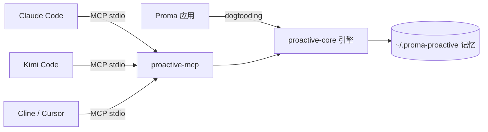

# ProactiveAgent 🧠

> **教一次，处处用。** 让 Claude Code / Kimi Code / Cline / Cursor / Proma 共享同一份「主动记忆」，并在合适的时机主动提醒你——一个 MCP 挂载，所有 agent 立即拥有主动能力。

[](LICENSE)
[](https://bun.sh)
[](https://github.com/ConradLu2740/ProactiveAgent)

---

## 为什么值得用

### 🎯 记忆是「用户级资产」，不是「工具级资产」

你在 Claude Code 里教会它的偏好，Kimi Code、Cline 里**自动生效**——因为记忆存在 `~/.proma-proactive/`，所有 agent 通过同一个 MCP server 读写同一份记忆。

> 告别「每个工具都要重新教一遍」：教一次 TypeScript 偏好，所有 agent 都记得。

### 💡 主动建议：该沉默时沉默

不是话痨推送，而是**有信号才开口**：
- 你纠正了 agent → 建议把规则写进长期记忆（防重犯）
- 你重复做同一件事 → 建议自动化 / 沉淀为流程
- 闲聊、拒绝、打扰时段 → **安静**（这就是能力）

### 🛡️ 防投毒设计，记忆安全有底线

- 自动提取的记忆默认 **pending（待确认）**，你确认才进入召回——阻断恶意/错误内容注入
- LLM 配置**同源原则**：apiKey 决定信任源，绝不跨源混搭，防 key 劫持
- 一条记忆/一条纠正，你都能**查看、确认、拒绝、删除**

### 🔌 即插即用，一个 MCP 挂所有

标准 MCP 协议（stdio），**零代码改动**挂载到任何支持 MCP 的 agent。已在 **Claude Code、Kimi Code、Proma 三个完全不同的宿主**真实验证。

---

## 快速开始（< 1 分钟）

> ⚠️ npm 包即将上线（Trusted Publishing 流程已就绪，受 npm 政策影响暂缓）。当前从 GitHub 使用。

**方式 A：clone 仓库直接用**
```bash
git clone https://github.com/ConradLu2740/ProactiveAgent.git && cd ProactiveAgent
bun install

# 一键生成挂载配置（Claude Code / Kimi Code / Cline / Cursor 通用）
bun run packages/proactive-mcp/src/index.ts init

# 或手动挂载到 Claude Code
claude mcp add proactive-agent -- bun run $(pwd)/packages/proactive-mcp/src/index.ts
```

**方式 B：起一个本地主动中心面板**
```bash
bun run packages/proactive-mcp/src/index.ts --today
# 打开 http://127.0.0.1:8737/today —— 建议、场景、画像、统计一目了然
```

**挂载后立刻试**：
```
agent: 以后提交代码前必须先写单元测试再提交
→ agent 建议把这条规则写入长期记忆（memory_extract / suggest_now）
agent: 我偏好用 TypeScript 和 Bun
→ agent 调用 memory_capture 记住（下次任何工具都记得）
```

---

## 能力总览

### Tools（17 个，任何宿主可用）

| 类别 | 工具 | 干什么 |
|---|---|---|
| 🧠 记忆写入 | `memory_capture` | 显式记住一条（偏好/事实/纠正/流程，立即生效） |
| 🧠 记忆提取 | `memory_extract` | 把对话交给引擎自动提取（默认待确认，防投毒） |
| 🔍 记忆检索 | `memory_recall` | 关键词/混合检索，任务开始前注入上下文 |
| ✅ 记忆闭环 | `memory_pending` / `confirm` / `reject` | 待确认记忆 + 行为纠正的确认/拒绝 |
| 👤 画像 | `persona_get` | 读取 L3 用户画像（稳定偏好/行为规则） |
| 🔥 场景 | `scene_summary` | 近期热点场景（"你最近在忙什么"） |
| 📊 统计 | `memory_stats` | 记忆系统统计 |
| 💡 建议 | `suggest_now` / `list` / `accept` / `ignore` | 主动建议评估 + 反馈闭环（频率学习） |
| 📋 模板 | `daily_review` / `onboarding_guide` | 每日复盘 / 使用说明 |

### Resources & Prompts

- `memory://today` — 今日建议 + 热点场景
- `memory://stats`、`memory://persona`
- Prompts：`daily_review`（每日复盘）、`onboarding`（冷启动引导）

### 附加能力

- **/today Web 面板**：本地主动中心（15s 自动刷新），任何宿主都能开浏览器看
- **Claude Code hooks**：会话开始时推送今日建议（today-push），结束时自动沉淀记忆 + 评估建议（session-end）

---

## 使用场景

### 场景 1：跨工具共享的长期记忆
```
今天：在 Claude Code 里说"我偏好用 TypeScript"
明天：打开 Kimi Code 写代码，它自动 recall 到你的偏好，直接按你的习惯来
```

### 场景 2：从"纠正"到"永不再犯"
```
你说："以后提交前先写单元测试"
→ suggest_now 识别为 correction 建议
→ 你点"接受"：规则写入记忆 + 回流用户画像
→ 以后所有 agent 都遵守这条规则
```

### 场景 3：每日复盘自动沉淀
```
会话结束（Claude Code Stop hook / 手动 daily_review）
→ memory_extract 提取今天的记忆（待确认）
→ suggest_now 评估是否有值得的建议
→ 打开 /today 面板：今日建议 + 热点场景 + 画像
```

---

## 架构



- **`@proactive-agent/core`**：headless 引擎（记忆 + 建议），零运行时依赖，可被任意宿主消费
- **`@proactive-agent/mcp`**：MCP Server 包装层（tools/resources/prompts + 面板 + hooks）

### 记忆分层模型

```
L1 Atom    结构化记忆条目（LLM 提取 + 去重 + 优先级）
L2 Scene   场景块（近期主题聚合，主动性时机信号）
L3 Persona 用户画像 markdown（稳定偏好，带来源溯源）
Correction 行为纠正候选（需确认后生效）
```

---

## 安全与隐私

| 设计 | 说明 |
|---|---|
| 默认 pending | 自动提取的记忆需确认才进入召回，阻断投毒链 |
| LLM 同源原则 | apiKey 决定主信任源，baseUrl/model 只从同源取；baseUrl 仅 https |
| 数据本地优先 | 记忆存在本机 `~/.proma-proactive/`，无云同步 |
| 用户控制 | 每条记忆/纠正可确认、拒绝、删除、清空 |
| 免打扰时段 | DND（默认 22:30-08:00）不产生新建议 |
| 克制原则 | 单次最多 1 条建议、同会话预算限制、"该沉默时沉默" |

---

## FAQ

**Q：支持哪些 agent？**
A：任何支持 MCP 的 agent：Claude Code、Kimi Code、Cline、Cursor、Windsurf、VS Code 等。Proma 原生（dogfooding）。

**Q：记忆存在哪？**
A：默认 `~/.proma-proactive/`，可用 `PROACTIVE_DATA_DIR` 覆盖。纯本地文件（JSONL/markdown），可随时备份/迁移。

**Q：需要 API key 吗？**
A：记忆写入 `memory_capture`、检索 `memory_recall` 不需要。`memory_extract` 的 LLM 提取可选（配 `MEMORY_LLM_*` 环境变量），未配置时自动降级规则模式（零外发）。

**Q：和其他记忆方案有什么区别？**
A：多数方案是"单工具的被动记忆"。ProactiveAgent 是**跨工具共享 + 主动建议**——教一次处处用，且只在合适的时机主动开口。

**Q：会把我的对话发给外部吗？**
A：只有 `memory_extract` 的 LLM 模式会把**当前对话片段**发给你自己配置的 LLM（默认 DeepSeek 兼容接口）；规则模式零外发。显式 capture/recall 纯本地。

---

## Roadmap

- [x] 核心引擎（记忆 + 建议 + 场景 + 画像）
- [x] MCP Server + 面板 + hooks
- [x] Proma / Claude Code / Kimi Code 真实验证
- [ ] npm 发布（等待 npm 政策 / 账号条件）
- [ ] embedding 本地化（默认可选）
- [ ] 多语言 README
- [ ] 自动归档 / TTL 记忆管理

## 贡献

欢迎 PR / Issue！开发环境：Bun + TypeScript。`bun install && bun test && bun run build`

## License

[MIT](LICENSE)
